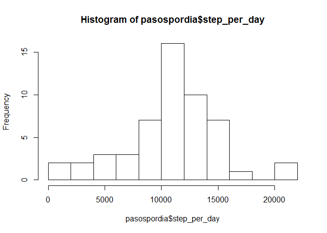
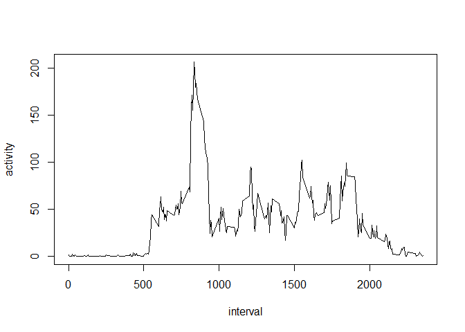
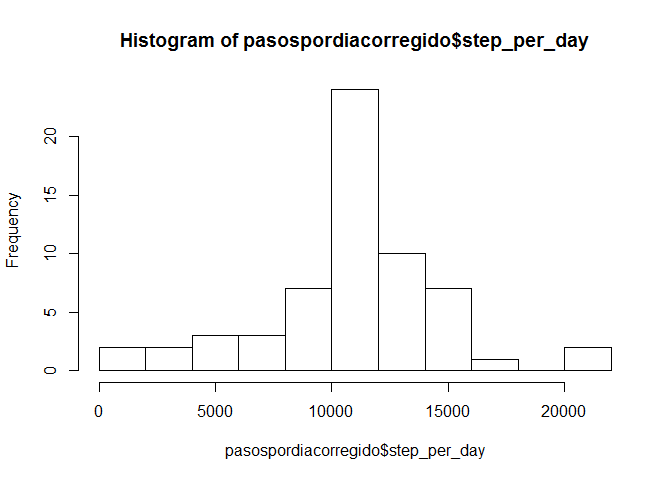
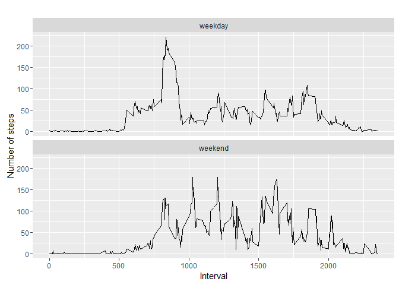

# PA1_template.Rmd
Simon Merino  
12 de noviembre de 2016  


## Week 2 Assignment

This is the R Markdown document needed for Week 2 assignment

## Loading and preprocessing the data

This is the code that loads the data from the provided url


```r
url="https://d396qusza40orc.cloudfront.net/repdata%2Fdata%2Factivity.zip"
download.file(url,"./activity.zip")

unzip("./activity.zip")
```


## What is mean total number of steps taken per day?


```r
#What is mean total number of steps taken per day?
prueba<-read.csv("activity.csv")
porfecha<-group_by(prueba,date)
pasospordia<-summarize(porfecha,step_per_day=sum(steps))
hist(pasospordia$step_per_day, breaks=15)
```

<!-- -->

```r
#median and average
median(pasospordia$step_per_day ,na.rm= TRUE)
```

```
## [1] 10765
```

```r
mean(pasospordia$step_per_day ,na.rm= TRUE)
```

```
## [1] 10766.19
```


## What is the average daily activity pattern?


```r
#What is the average daily activity pattern? Plot it!
pasosporrop<-group_by(prueba, interval)
average_daily_activity_pattern<-summarize(pasosporrop, activity=mean(steps, na.rm = TRUE))
with(average_daily_activity_pattern, plot(interval,activity, type="l"))
```

<!-- -->

```r
# 5-minute interval with maximum number of steps on average
ordered<-arrange(average_daily_activity_pattern, -activity)
ordered[1,1]
```

```
## # A tibble: 1 x 1
##   interval
##      <int>
## 1      835
```

## Imputing missing values

```r
#Calculate and report the total number of missing values in the dataset (i.e. the total number of rows with NAs)
sum(is.na(prueba$steps))
```

```
## [1] 2304
```

```r
#Devise a strategy for filling in all of the missing values in the dataset. The strategy does not need to be sophisticated. For example, you could use the mean/median for that day, or the mean for that 5-minute interval, etc.

newdata<-prueba
for (i in 1:nrow(newdata)){
  if (is.na(newdata$steps[i])){
    newdata$steps[i]<-as.numeric(select(filter(average_daily_activity_pattern,interval==newdata$interval[i]), activity))
    
  }
}

porfechacorregido<-group_by(newdata,date)
pasospordiacorregido<-summarize(porfechacorregido,step_per_day=sum(steps))
hist(pasospordiacorregido$step_per_day, breaks=15)
```

<!-- -->

```r
mean(newdata$steps)
```

```
## [1] 37.3826
```

```r
median(newdata$steps)
```

```
## [1] 0
```


## Are there differences in activity patterns between weekdays and weekends?


```r
# Are there differences in activity patterns between weekdays and weekends?
for (i in 1:nrow(newdata)){
  if (weekdays(ymd(newdata$date[i])) %in% c("domingo","sabado")){
    newdata$weekday[i]<-"weekend"
  }else{
    newdata$weekday[i]<-"weekday"
  }
}

newdata$weekday<-as.factor(newdata$weekday)
#Make a panel plot containing a time series plot (i.e. type = "l") of the 5-minute interval (x-axis) and the average number of steps taken, averaged across all weekday days or weekend days (y-axis).

#porfecha_corregido<-group_by(newdata,interval)
#pasospordia_corregido<-summarize(porfecha_corregido,step_per_day=sum(steps))
steps_per_day <- aggregate(steps ~ interval+weekday, newdata, mean)

#ggplot(pasospordia_corregido, aes(step_per_day,interval))+geom_line()+facet_grid(.~weekday)
qplot(interval, steps, data=steps_per_day, geom=c("line"), xlab="Interval", 
      ylab="Number of steps", main="") + facet_wrap(~ weekday, ncol=1)
```

<!-- -->
